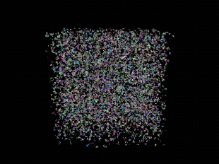

# FuzzyDR



A rasterization-based differentiable renderer that supports [**stochastic opacity masking**](https://arxiv.org/abs/2603.27151) and high-quality **multisample anti-aliasing (MSAA)** for optimizing graphics primitives (e.g., triangles, line segments, and polylines), *without introducing heuristic, task-specific semi-transparency*.

The Python package `fuzzydr` integrates with [PyTorch](https://pytorch.org/)'s autograd.
It uses [Vulkan](https://vulkan.org/) for cross-platform, hardware-accelerated rendering and differentiation.

FuzzyDR was originally developed as part of the ACM Transactions on Graphics paper [*Inverse Rendering for Modeling with Line Primitives*](https://kenji-tojo.github.io/sa26-line-primitives/).

## Installation

### 0. Environment

This guide assumes Linux or macOS and Python >= 3.10.

Create and activate a Python virtual environment using your preferred environment manager. For example, using Python's built-in `venv`:

```bash
python3 -m venv venv
source ./venv/bin/activate
```

---

### 1. Install Vulkan

`fuzzydr`'s CMake configuration locates Vulkan using:

```cmake
find_package(Vulkan REQUIRED)
```

To make Vulkan available to CMake, first download the [Vulkan SDK](https://vulkan.lunarg.com/sdk/home), extract it to a directory of your choice, and source the provided setup script:

```bash
source <WHERE_YOU_PUT_VULKAN_SDK>/1.4.350.1/setup-env.sh
```

Adjust the version number (`1.4.350.1` above) to match the version you downloaded.

*CUDA/Vulkan interoperability (optional):* If the CUDA Toolkit is installed and detected by CMake, interoperability between CUDA and Vulkan is automatically enabled. This allows `fuzzydr` to integrate efficiently with other parts of a training pipeline that use CUDA.

---

### 2. Install PyTorch (>= 2.1.0)

Install [PyTorch](https://pytorch.org/get-started/locally/) according to your platform, GPU availability, and CUDA version. Since `fuzzydr` uses Vulkan for its core rendering and differentiation functionality, it can also work with a CPU-only build of PyTorch.

For example, PyTorch can typically be installed with:

```bash
pip3 install torch torchvision
```

Please refer to the [PyTorch installation guide](https://pytorch.org/get-started/locally/) for the appropriate command for your platform and CUDA version.

---

### 3. Install `fuzzydr`

You can now build and install the `fuzzydr` module with:

```bash
pip3 install -v .
```

The required build dependencies, including `scikit-build-core` and [`nanobind`](https://nanobind.readthedocs.io/en/latest/), are installed automatically as specified in `pyproject.toml`. The build process compiles the shaders and the native `_core` extension.

The optional interactive viewer module, `fuzzydr_viewer`, can be installed similarly:

```bash
pip3 install -v ./viewer/
```

The viewer is standalone and can be built and installed without the main `fuzzydr` module.

## Examples

Now you are ready to develop and run your differentiable rendering code using `fuzzydr`.

We provide [examples](examples/) demonstrating the main features of `fuzzydr`. For more complex reconstruction examples at scale, please also refer to [this project](https://github.com/kenji-tojo/inverse-line-primitives).

## Multi-GPU Systems

FuzzyDR, including the examples in `./examples/`, is developed and primarily intended for single-GPU use. It can also run on multi-GPU systems, with one caveat: CUDA/Vulkan interoperability requires PyTorch and Vulkan to use the same physical GPU.

The Vulkan device can be selected using the `FUZZYDR_DEVICE_INDEX` environment variable, while the CUDA device can be selected using `CUDA_VISIBLE_DEVICES` as usual.

Note that CUDA and Vulkan may use different device indexing. For example, on a two-GPU system we tested, the following configuration:

```bash
export CUDA_VISIBLE_DEVICES=0
export FUZZYDR_DEVICE_INDEX=1
```

selects the same physical GPU on both sides. When using CUDA/Vulkan interoperability on a multi-GPU system, you may need to determine the corresponding CUDA and Vulkan device indices for your system.

## Citation

If you find this project useful, please consider citing the following publications:

```bibtex
@InProceedings{tojo2026diffsoup,
    author    = {Tojo, Kenji and Bickel, Bernd and Umetani, Nobuyuki},
    title     = {DiffSoup: Direct Differentiable Rasterization of Triangle Soup for Extreme Radiance Field Simplification},
    booktitle = {Proceedings of the IEEE/CVF Conference on Computer Vision and Pattern Recognition (CVPR)},
    month     = {June},
    year      = {2026},
    pages     = {8353-8363}
}

@article{tojo2026lines,
    author = {Tojo, Kenji and Shamir, Ariel and Umetani, Nobuyuki and Bickel, Bernd},
    title = {Inverse Rendering for Modeling with Line Primitives},
    year = {2026},
    issue_date = {December 2026},
    publisher = {Association for Computing Machinery},
    volume = {45},
    number = {6},
    url = {https://doi.org/10.1145/3842527},
    doi = {10.1145/3842527},
    journal = {ACM Trans. Graph.},
    month = dec,
    articleno = {200},
    numpages = {13}
}
```
